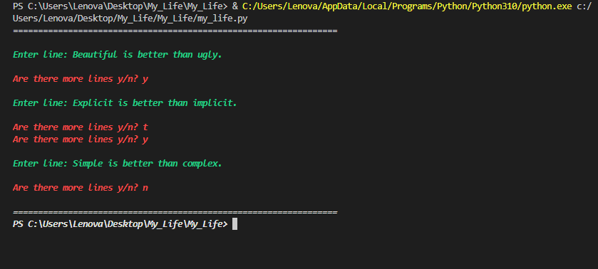
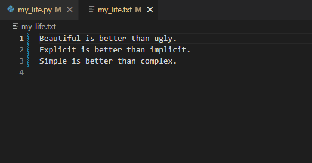

# My_Life
### Programming Exercise 3

Write a method in python to write multiple line of text contents into a text file mylife.txt. See sample output:
Enter line: Beautiful is better than ugly.
Are there more lines y/n? y
Enter line: Explicit is better than implicit.
Are there more lines y/n? y
Enter line: Simple is better than complex.
Are there more lines y/n? n 

# Example Output

# Example Appended files after running the Program
 
# How To Use / Run
1. Install Python on your computer to run the code. You can download its latest version here: https://www.python.org/downloads/ 
2. Copy the code from the repository. 
3. Open an IDE and paste the code. 
4. Save the file with a .py extension. 
5. Run the code. 
